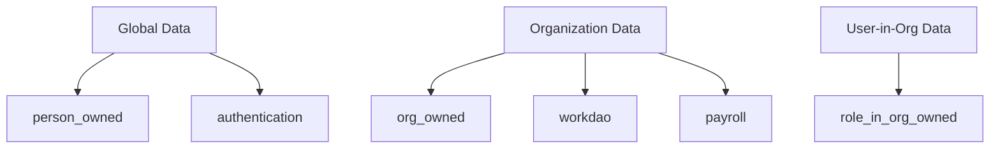

## Overview

TGA is a multi-tenant platform where each organization's data is strictly isolated. This document explains the technical mechanisms that ensure data separation and security.

## Tenancy Model

TGA uses a **shared database, separate schema** approach:

| Component | Isolation Level |
|-----------|-----------------|
| **Application** | Shared (single deployment) |
| **Database** | Shared PostgreSQL instance |
| **Schemas** | Multiple schemas by data ownership |
| **Data** | Row-level isolation by `orgID` |

## Schema Architecture

### Ownership Buckets

Data is organized into "buckets" based on ownership:



### Schema Details

| Schema | Ownership | Examples |
|--------|-----------|----------|
| `person_owned` | Per person (global) | Person, User |
| `org_owned` | Per organization | Organization, TokenType, Distribution |
| `role_in_org_owned` | Per user-in-org | Grant, Vesting, Wallet |
| `workdao` | Legacy (org-scoped) | Employee, Document |
| `payroll` | Per organization | Payroll, PayrollApproval |
| `tax_engine` | Global | TaxCalculator, TaxProfile |
| `authentication` | Global | Nonces, Tokens |

## Automatic Data Filtering

### authorisedPrisma

Every authenticated operation uses `authorisedPrisma`, which automatically filters queries by organization:

```typescript
// Developer code - no org filter needed
const grants = await authorisedPrisma.grant.findMany({
    where: { status: 'ACTIVE' }
});

// Prisma extension automatically adds org filter:
// SELECT * FROM grant
// WHERE status = 'ACTIVE'
//   AND org_id = '${credentials.orgID}'
```

### Filter Injection Logic

The system determines which filter to apply based on the model's bucket:

```typescript
function getMandatoryFilterObject(credentials, bucketName, model) {
    switch (bucketName) {
        case 'org_owned':
            return { orgID: credentials.orgID };

        case 'role_in_org_owned':
            return { roleInOrgID: credentials.roleInOrgID };

        case 'person_owned':
            return { personID: credentials.person.personID };

        case 'global':
            return {}; // No filter needed
    }
}
```

### TOKU_ADMIN Bypass

Platform administrators bypass organization filtering:

```typescript
// In Prisma extension
if (credentials.role === Role.TOKU_ADMIN) {
    return query(args); // No filtering
}
```

<Warning>
TOKU_ADMIN has unrestricted database access. This role should only be assigned to platform staff.
</Warning>

## Data Ownership Models

### Organization-Owned (org_owned)

Data belonging to the organization:

```typescript
// Models in org_owned schema
Organization
TokenType
DistributionSettings
SafeWallet
CustodyWallet
StakingConfiguration
PayrollEntity
Credentials  // Integration credentials
```

### Role-in-Org-Owned (role_in_org_owned)

Data belonging to a specific user within an organization:

```typescript
// Models in role_in_org_owned schema
Grant
Vesting
Wallet
WalletReference
Investment
Warrant
ExerciseRequest
StakingRequest
TaxReference
```

### Person-Owned (person_owned)

Global user data not tied to any organization:

```typescript
// Models in person_owned schema
Person
User
```

## Foreign Key Validation

The system validates foreign keys across ownership boundaries:

```typescript
// Validates that related records belong to same org
validateForeignKeyExistence(model, bucketName);
validateRestrictedJoins(args);
```

### Cross-Bucket References

| From Bucket | Can Reference | Notes |
|-------------|---------------|-------|
| `org_owned` | `org_owned` | Same org only |
| `role_in_org_owned` | `org_owned` | Parent org |
| `role_in_org_owned` | `role_in_org_owned` | Same roleInOrg |
| `person_owned` | Global only | No org data |

## Soft Delete Handling

Multi-tenant data uses soft deletes for audit compliance:

```typescript
// Find operations exclude soft-deleted records
const grants = await authorisedPrisma.grant.findMany({});
// Adds: WHERE deletedAt IS NULL

// Delete operations set deletedAt instead of removing
await authorisedPrisma.grant.delete({ where: { grantID } });
// Executes: UPDATE grant SET deletedAt = NOW() WHERE ...
```

### Cascade Soft Delete

Related records are soft-deleted together:

```typescript
// Deleting a grant also soft-deletes:
// - Vestings
// - WalletReferences
// - Related documents
```

## Organization Lifecycle

### Organization Creation

New organizations are isolated from creation:

```typescript
// Creating org generates unique orgID
const org = await prisma.organization.create({
    data: {
        orgName: 'New Corp',
        orgType: 'CLIENT',
        // ... other fields
    }
});

// All future data linked to this orgID
```

### Organization Status

| Status | Data Access | Description |
|--------|-------------|-------------|
| `ACTIVE` | Full access | Normal operation |
| `INACTIVE` | Admin only | Suspended |
| `isDeleted: true` | No access | Marked for deletion |
| `isOrganizationHidden` | TOKU only | Hidden from users |

## Integration Credentials

Integration credentials are stored per-organization:

```typescript
model Credentials {
    credentialsID String
    orgID String                      // Organization owner
    type ExternalIntegrationType      // ADP, WORKDAY, etc.
    encryptionIv String               // Encryption IV
    details Json                      // Encrypted credentials
    isEmployeeIntegration Boolean
    isPayrollIntegration Boolean
}
```

<Note>
Each organization has its own set of encrypted integration credentials.
</Note>

## Session Context

### Organization in Session

The user's current organization is stored in session:

```typescript
interface Session {
    orgID: string;        // Current organization
    role: Role;           // Role in that organization
    roleInOrgID: string;  // Specific role instance
}
```

### Switching Organizations

Users with multiple org memberships can switch:

1. User selects different organization
2. Session updated with new `orgID`, `role`, `roleInOrgID`
3. All queries automatically use new context
4. UI refreshes with new organization's data

## Testing Multi-Tenancy

### User Spoofing

TOKU_ADMIN can test as different users:

```typescript
// Session includes spoofUserEmail for testing
session.spoofUserEmail = 'user@othercorp.com';

// System loads credentials for spoofed user
// Allows testing without actual login
```

### Demo Organizations

Test organizations for development:

| Org Type | Purpose |
|----------|---------|
| `DEMO` | Demo/sales purposes |
| `STABLECOIN_DEMO` | Stablecoin feature demos |
| `CLIENT` | Real customer organizations |
| `TOKU` | Platform administration |

## Best Practices

<Tip>
Follow these guidelines for multi-tenant development.
</Tip>

1. **Always use authorisedPrisma** - Never use raw Prisma client
2. **Don't hardcode orgID** - Use credentials.orgID from context
3. **Test with multiple orgs** - Verify data isolation in tests
4. **Audit cross-org queries** - Review any TOKU_ADMIN operations
5. **Validate foreign keys** - Ensure references stay within org

## Troubleshooting

<AccordionGroup>
<Accordion title="Data from wrong organization appearing">
**Cause:** Using raw Prisma client instead of authorisedPrisma.

**Solutions:**
1. Always use `authorisedContext.authorisedPrisma`
2. Never import and use `prisma` directly in operations
3. Check for any custom queries bypassing extensions
</Accordion>

<Accordion title="'Cannot find record' when record exists">
**Cause:** Record belongs to different organization than session.

**Solutions:**
1. Verify the record's orgID matches session.orgID
2. Check if user has correct role in that organization
3. For admin access, use TOKU_ADMIN role
</Accordion>

<Accordion title="Foreign key constraint errors">
**Cause:** Trying to link records across organizations.

**Solutions:**
1. Verify both records belong to same organization
2. Check bucket ownership rules
3. Use proper reference patterns
</Accordion>
</AccordionGroup>
