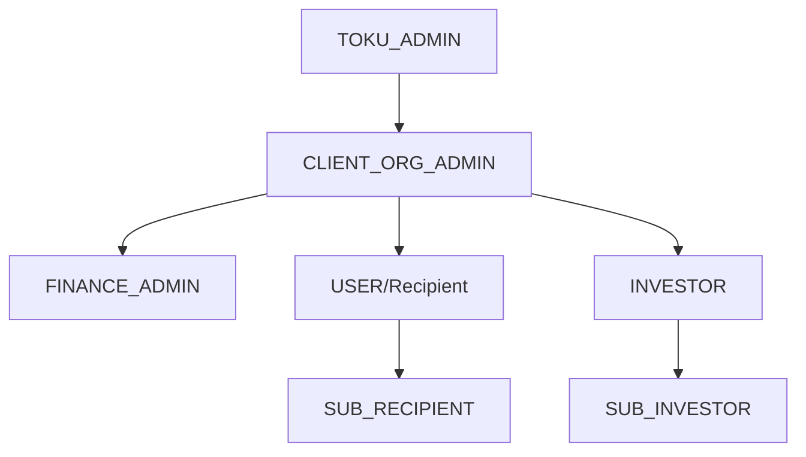

## Overview

TGA implements role-based access control (RBAC) to manage user permissions across organizations. Each user has one or more roles within specific organizations, determining their access to features and data.

## Role Hierarchy



## Available Roles

| Role | Description | Scope |
|------|-------------|-------|
| `TOKU_ADMIN` | Platform super administrator | All organizations |
| `CLIENT_ORG_ADMIN` | Organization administrator | Single organization |
| `FINANCE_ADMIN` | Finance/payment integration access | Single organization |
| `USER` | Grant recipient (employee) | Single organization |
| `INVESTOR` | Investment/cap table access | Single organization |
| `SUB_INVESTOR` | Delegated investor access | Single organization |
| `SUB_RECIPIENT` | Delegated recipient access | Single organization |

## Role Capabilities

### TOKU_ADMIN

Platform-level administrator with full access:

| Capability | Description |
|------------|-------------|
| Cross-org access | View and manage all organizations |
| User spoofing | Impersonate any user for support |
| System settings | Configure platform-wide settings |
| All operations | Access to all API endpoints |
| Bypass filters | Org filtering disabled for queries |

<Warning>
TOKU_ADMIN role should only be assigned to Toku platform staff.
</Warning>

### CLIENT_ORG_ADMIN

Organization administrator with full org-level access:

| Capability | Description |
|------------|-------------|
| Grant management | Create, edit, delete grants |
| User management | Invite users, assign roles |
| Integration setup | Configure custody, HRIS, payroll |
| Distribution control | Approve and execute distributions |
| Reporting | Access all organization reports |
| Settings | Configure organization settings |

### FINANCE_ADMIN

Limited administrative access for finance teams:

| Capability | Description |
|------------|-------------|
| Payment integrations | Configure Fireblocks, Anchorage, etc. |
| Settlement review | View settlement transactions |
| Payroll access | View payroll data |
| Limited admin | No user management or grant creation |

### USER (Recipient)

Standard grant recipient access:

| Capability | Description |
|------------|-------------|
| View grants | See assigned token grants |
| Wallet setup | Configure receiving wallet |
| Exercise options | Submit option exercise requests |
| View vesting | Track vesting schedule |
| Claim tokens | Receive vested tokens |
| Profile | Manage personal information |

### INVESTOR

Investment and cap table access:

| Capability | Description |
|------------|-------------|
| View investments | See investment allocations |
| Investor entities | Manage investor entities |
| Cap table | View cap table information |
| Wallet setup | Configure receiving wallets |
| Invite sub-investors | Delegate access |

### SUB_INVESTOR / SUB_RECIPIENT

Delegated access roles:

| Capability | Description |
|------------|-------------|
| Limited view | Access delegated by parent role |
| No management | Cannot modify settings |
| Invite chain | Linked to inviting user |

## Role Assignment

### RoleInOrg Model

Users are assigned roles through the `RoleInOrg` junction:

```typescript
interface RoleInOrg {
    roleInOrgID: string;      // Unique identifier
    personID: string;         // The person
    orgID: string;            // The organization
    role: Role;               // The role type
    onboarded: boolean;       // Completed onboarding
    revokedAt?: Date;         // If access revoked

    // For delegated roles
    invitedByInvestorID?: string;
    invitedByRecipientID?: string;
}
```

### Multiple Roles

A person can have multiple roles:
- Different roles in the same organization
- Same role in multiple organizations
- Combination of both

```typescript
// User's roles available in session
credentials.allRolesForPerson: [
    { role: 'CLIENT_ORG_ADMIN', orgID: 'org-1', orgName: 'Acme Corp' },
    { role: 'USER', orgID: 'org-2', orgName: 'Beta Inc' },
    { role: 'INVESTOR', orgID: 'org-3', orgName: 'Gamma LLC' }
]
```

## Operation Authorization

### Operation Classes

Operations enforce role requirements:

```typescript
// Anyone logged in
class MyOperation extends AuthorisedOperation<Req, Resp> {}

// Admin roles only
class MyAdminOperation extends AdminOperation<Req, Resp> {}

// Toku staff only
class MyTokuOperation extends TokuAdminOperation<Req, Resp> {}

// Finance or admin
class MyFinanceOperation extends FinanceAdminOperation<Req, Resp> {}
```

### Permission Checks

Operations validate permissions:

```typescript
// AdminOperation checks
checkPermissions(credentials) {
    if (credentials.role !== Role.TOKU_ADMIN &&
        credentials.role !== Role.CLIENT_ORG_ADMIN) {
        throw new TokuError('Permission denied');
    }
}

// FinanceAdminOperation checks
checkPermissions(credentials) {
    if (credentials.role !== Role.FINANCE_ADMIN &&
        credentials.role !== Role.CLIENT_ORG_ADMIN &&
        credentials.role !== Role.TOKU_ADMIN) {
        throw new TokuError('Permission denied');
    }
}
```

## Organization Access

### Active Organization Check

Users can only access active organizations:

```typescript
// Session validation includes
org: {
    isOrganizationHidden: false,
    isDeleted: false,
    orgStatus: OrgStatus.ACTIVE
}

// Exception: CLIENT_ORG_ADMIN can access inactive orgs
// Exception: TOKU_ADMIN can access any org
```

### Organization Status

| Status | CLIENT_ORG_ADMIN | Other Roles |
|--------|------------------|-------------|
| `ACTIVE` | Full access | Full access |
| `INACTIVE` | Full access | No access |
| `isDeleted: true` | No access | No access |

## Feature Flags by Organization

Organizations can enable/disable features:

| Flag | Description |
|------|-------------|
| `isStableCoinPayrollEnabled` | Enable stablecoin payroll |
| `tokenGrantsEnabled` | Enable token grants |
| `stakingEnabled` | Enable staking features |
| `distributionEnabled` | Enable distributions |
| `custodyEnabled` | Enable custody integration |
| `aiAssistantEnabled` | Enable AI assistant |

## Session Management

### Session Contents

```typescript
interface Session {
    user: { email: string };
    orgID: string;              // Current organization
    role: Role;                 // Current role
    roleInOrgID: string;        // Current role instance

    // For delegated access
    invitedByInvestorID?: string;
    invitedByRecipientID?: string;
    investorEntityID?: string;

    // Admin features
    spoofUserEmail?: string;    // TOKU_ADMIN only
}
```

### Role Switching

Users with multiple roles can switch between them:
1. Select different organization
2. Select different role within organization
3. Session updates with new context
4. UI reflects new permissions

## Best Practices

<Tip>
Follow these guidelines for role management.
</Tip>

1. **Principle of least privilege** - Assign minimum necessary role
2. **Regular audits** - Review role assignments periodically
3. **Separate admin accounts** - Use dedicated admin accounts
4. **Document access** - Maintain records of role assignments
5. **Revoke promptly** - Remove access when no longer needed

## Troubleshooting

<AccordionGroup>
<Accordion title="'User does not have a role in the org'">
**Cause:** User trying to access an organization they're not a member of.

**Solutions:**
1. Verify the user has been invited to the organization
2. Check if the role assignment exists in RoleInOrg
3. Verify the organization is active
</Accordion>

<Accordion title="'Permission denied'">
**Cause:** User's role doesn't have access to the operation.

**Solutions:**
1. Check required role for the operation
2. Verify user's current role in session
3. Contact admin if role upgrade needed
</Accordion>

<Accordion title="Can't switch organizations">
**Cause:** User may not have roles in other organizations.

**Solutions:**
1. Check `allRolesForPerson` in credentials
2. Verify organization status is ACTIVE
3. Ensure role is not revoked
</Accordion>
</AccordionGroup>
