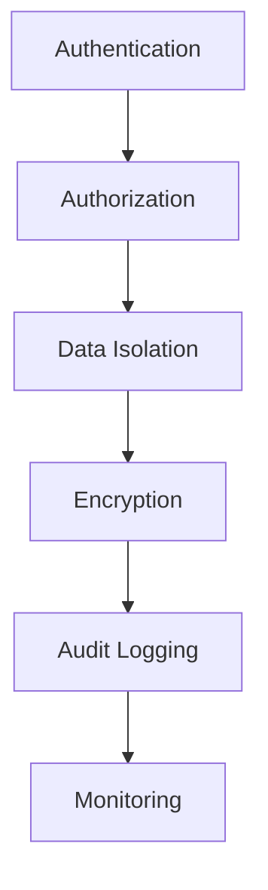

## Overview

TGA handles sensitive financial data and cryptocurrency transactions. This document outlines the security architecture and controls that protect the platform and its users.

## Security Layers



## Authentication

### Session-Based Auth

TGA uses NextAuth.js for session management:

```typescript
// Session contains
{
    user: { email: string };
    orgID: string;
    role: Role;
    roleInOrgID: string;
}
```

### Password Security

| Feature | Implementation |
|---------|----------------|
| **Hashing** | bcrypt with salt |
| **Min Length** | Configurable per org |
| **Reset Flow** | Time-limited tokens |
| **MFA** | Optional per organization |

### MFA Support

Organizations can require multi-factor authentication:

```typescript
// Organization settings
{
    mfaEnabled: boolean;
    mfaRequiredForAdmins: boolean;
}
```

### SSO Integration

Enterprise SSO via Okta:

```typescript
// Organization settings
{
    oktaSSOEnabled: boolean;
    oktaDomain: string;
    oktaClientId: string;
}
```

## Authorization

### Operation-Level Security

Every API endpoint enforces authorization:

```typescript
// Authorization check in every operation
async checkAuthorization(serverContext) {
    // 1. Validate session exists
    if (!session) throw new TokuError('Not logged in');

    // 2. Validate user exists
    const user = await getUserByEmail(session.user.email);
    if (!user) throw new TokuError('User not found');

    // 3. Validate role in org
    const roleInOrg = await getRoleInOrg(session);
    if (!roleInOrg) throw new TokuError('No role in org');

    // 4. Build authorized context
    return { credentials, authorisedPrisma, services };
}
```

### Role-Based Permissions

Operations enforce role requirements:

| Operation Type | Required Roles |
|----------------|----------------|
| `PublicOperation` | None (public) |
| `AuthorisedOperation` | Any logged-in user |
| `AdminOperation` | TOKU_ADMIN, CLIENT_ORG_ADMIN |
| `TokuAdminOperation` | TOKU_ADMIN only |
| `FinanceAdminOperation` | FINANCE_ADMIN, CLIENT_ORG_ADMIN, TOKU_ADMIN |

## Data Security

### Multi-Tenant Isolation

Data is isolated by organization at the database level:

```typescript
// Automatic org filtering via Prisma extension
const authorisedPrisma = prisma.$extends({
    query: {
        $allModels: {
            $allOperations({ model, args, query }) {
                // Inject orgID filter based on credentials
                const filtered = injectMandatoryFilter(args, credentials);
                return query(filtered);
            }
        }
    }
});
```

### Soft Deletes

Data is never permanently deleted:

```typescript
// Delete becomes soft delete
await authorisedPrisma.grant.delete({ where: { grantID } });
// Executes: UPDATE SET deletedAt = NOW()

// Find excludes soft-deleted
await authorisedPrisma.grant.findMany({});
// Adds: WHERE deletedAt IS NULL
```

### Cascade Soft Delete

Related records are soft-deleted together, maintaining referential integrity.

## Credential Management

### Encrypted Storage

Integration credentials are encrypted:

```typescript
model Credentials {
    encryptionIv String;   // Unique IV per credential
    details Json;          // AES-256 encrypted data
}
```

### Credential Types

| Type | Sensitivity | Storage |
|------|-------------|---------|
| **API Keys** | High | Encrypted in DB |
| **Private Keys** | Critical | Encrypted in DB |
| **OAuth Tokens** | Medium | Encrypted in DB |
| **Passwords** | High | Hashed (bcrypt) |

### Environment Variables

Sensitive configuration via environment:

```bash
# Never commit these
DATABASE_URL=
ENCRYPTION_KEY=
NEXTAUTH_SECRET=
```

<Warning>
Never log, commit, or expose credentials. Use environment variables for all secrets.
</Warning>

## Input Validation

### Zod Schema Validation

All inputs validated with Zod:

```typescript
parseRequest(payload: JsonPayload): Request {
    return z.object({
        grantID: z.string().uuid(),
        amount: z.number().positive(),
        email: z.string().email()
    }).parse(payload);
}
```

### SQL Injection Prevention

Prisma parameterizes all queries:

```typescript
// Safe - parameterized
await prisma.grant.findMany({
    where: { grantName: userInput }
});

// Prisma generates: WHERE grant_name = $1
// With parameter: userInput
```

### XSS Prevention

React automatically escapes output. Additional measures:

- Content Security Policy headers
- Input sanitization
- Output encoding

## Audit Logging

### Activity Log

All significant actions are logged:

```typescript
captureActivityLog({
    eventType: 'GRANT_CREATED',
    eventDescription: 'Admin created new grant',
    resourceType: 'Grant',
    resourceID: grant.grantID,
    metadata: { /* additional context */ }
});
```

### Log Contents

| Field | Description |
|-------|-------------|
| `eventType` | Action category |
| `eventDescription` | Human-readable description |
| `resourceType` | Affected entity type |
| `resourceID` | Affected entity ID |
| `ipAddress` | Client IP |
| `headers` | Request headers |
| `orgID` | Organization context |
| `roleInOrgID` | User context |

### PII Protection

<Warning>
Never log personally identifiable information (PII).
</Warning>

Prohibited in logs:
- Email addresses
- Social Security Numbers
- Salary information
- Wallet addresses
- Bank account details

## Monitoring & Alerting

### Error Tracking

Sentry integration for error monitoring:

```typescript
// Automatic error capture
Sentry.captureException(error);

// Performance monitoring
const transaction = Sentry.startTransaction({
    name: 'Operation.executeLifecycle'
});
```

### Performance Monitoring

New Relic for performance:

```typescript
newrelic.addCustomAttributes({
    orgID: credentials.orgID,
    operationName: this.constructor.name,
    timeTaken: endTime - startTime
});
```

## P0 Critical Services

These services handle money and require extra scrutiny:

| Service | Risk | Protection |
|---------|------|------------|
| `fireblocks-service.ts` | Crypto transactions | Dual approval, rate limits |
| `custody-management-service.ts` | Fund allocation | Reconciliation checks |
| `settlement-service.ts` | Payment execution | Validation middleware |
| `batch-transaction-service.ts` | Bulk operations | Transaction limits |

### Change Management

For P0 services:
1. Show diff before modifying
2. Require explicit confirmation
3. Extra code review
4. Staged rollout

## Security Boundaries

### Agent Security Rules

For AI agents interacting with the codebase:

```
❌ NEVER output actual API keys or secrets
❌ NEVER include PII in reports or logs
❌ NEVER suggest changes to Prisma schema without warning
✅ ALWAYS sanitize file contents before including in issues
✅ ALWAYS validate inputs with Zod
✅ ALWAYS use authorisedPrisma for queries
```

### Network Security

| Layer | Protection |
|-------|------------|
| **Transport** | TLS 1.3 |
| **API** | Rate limiting |
| **Database** | VPC isolation |
| **Secrets** | Vault/KMS |

## Compliance

### Data Handling

| Requirement | Implementation |
|-------------|----------------|
| **Data Retention** | Soft deletes, configurable |
| **Right to Erasure** | Anonymization support |
| **Data Portability** | Export endpoints |
| **Audit Trail** | Comprehensive logging |

### Financial Compliance

| Area | Controls |
|------|----------|
| **KYC** | Persona integration |
| **AML** | Sanctions screening |
| **Tax** | Withholding calculations |
| **Custody** | Qualified custodians |

## Best Practices

<Tip>
Security guidelines for developers.
</Tip>

1. **Never bypass authorisedPrisma** - Always use org-scoped queries
2. **Validate all inputs** - Use Zod schemas in parseRequest
3. **Log carefully** - No PII, secrets, or credentials
4. **Review P0 changes** - Extra scrutiny for critical services
5. **Use environment variables** - No hardcoded secrets
6. **Test isolation** - Verify multi-tenant data separation
7. **Keep dependencies updated** - Regular security patches

## Incident Response

### Security Issues

1. **Identify** - Detect and classify the issue
2. **Contain** - Limit blast radius
3. **Eradicate** - Fix the root cause
4. **Recover** - Restore normal operation
5. **Learn** - Post-incident review

### Contact

For security concerns:
- **Internal**: security@toku.com
- **External**: security@toku.com (responsible disclosure)
