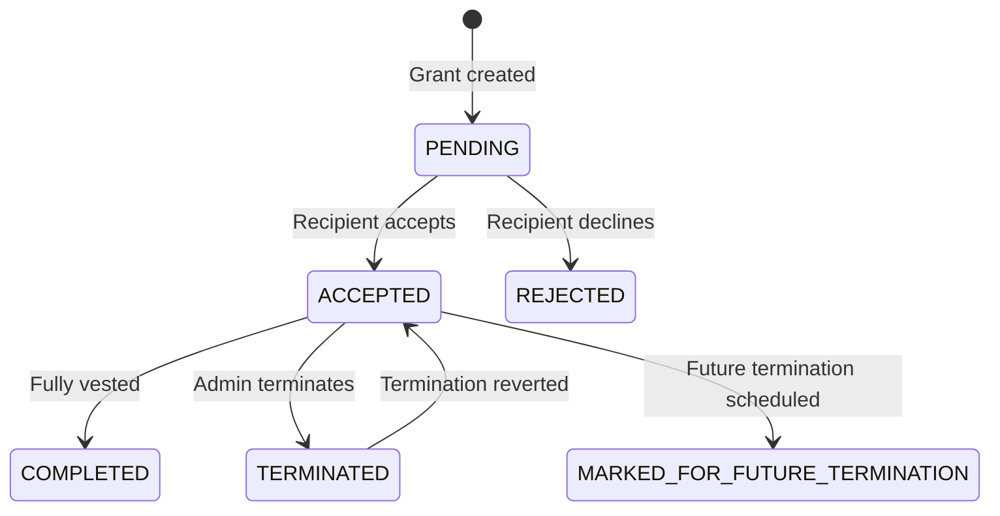

## Overview

Create token grants to award equity to your team. Each grant specifies the recipient, token amount, vesting schedule, and grant configuration.

---

## Creating a Single Grant

<Tabs>
  <Tab title="Dashboard">
    <Steps>
      <Step title="Navigate to Grants">
        Click **Grants** in the sidebar.
      </Step>
      <Step title="Click New Grant">
        Select **New Grant** to open the creation form.
      </Step>
      <Step title="Select grant configuration">
        Choose from your configured grant types (RTU, RTA, TPA, or TOKEN_BONUS). See [Grant Configurations](/tga/client/grant-configurations) to set these up.
      </Step>
      <Step title="Enter grant details">
        - **Recipient** — Select or search by email
        - **Grant amount** — Number of token units
        - **Grant name** — Descriptive name
        - **Grant date** — When the grant was issued
        - **Vesting start date** — When vesting begins
        - **Vesting schedule** — Select a template or configure custom
        - **Tags** — Optional categorization
      </Step>
      <Step title="Review and create">
        Review the summary and click **Create Grant**.
      </Step>
    </Steps>
  </Tab>
  <Tab title="API">
    Use the [Add Single Grant](/api/grants/add-single-grant) endpoint:

    ```bash
    curl -X POST https://app.toku.com/api/tokuApi/v1/addSingleGrant \
      -H "Authorization: Bearer YOUR_API_TOKEN" \
      -H "x-role-type: CLIENT_ORG_ADMIN" \
      -H "Content-Type: application/json" \
      -d '{
        "grantName": "Q1 2026 Token Grant - Jane Smith",
        "grantConfigurationID": "config-uuid",
        "grantAmount": 50000,
        "recipientID": "role-in-org-uuid",
        "vestingStartDate": "2026-01-01T00:00:00.000Z",
        "vestingFrequencyType": "MONTHLY",
        "vestingPeriods": 48,
        "vestingCliffPeriods": 12,
        "vestingCliffPercentage": 25,
        "tags": ["engineering", "2026"]
      }'
    ```

    For new hires, use [Create Grant for New Hire](/api/grants/create-grant-for-new-hire) to create the user and grant in one call.
  </Tab>
</Tabs>

---

## Grant Status Lifecycle



| Status | Description |
|--------|-------------|
| `PENDING` | Created, awaiting recipient acceptance |
| `ACCEPTED` | Accepted and actively vesting |
| `COMPLETED` | All vesting periods complete |
| `TERMINATED` | Terminated early |
| `MARKED_FOR_FUTURE_TERMINATION` | Termination scheduled for future date |
| `PAUSED` | Vesting temporarily paused |
| `REJECTED` | Declined by recipient |

---

## Bulk Grant Creation

For multiple grants, use [Bulk Upload](/tga/client/bulk-upload-grants):

1. Navigate to **Bulk Upload** → **Grants** tab
2. Download the CSV template
3. Fill in grant details for each recipient
4. Upload and review
5. Submit

---

## Updating Grants

Edit pending grants before they're accepted:
- Change token amount, vesting dates, or tags
- Update grant configuration
- Modify recipient assignment

<Tip>
After acceptance, use [Terminate Grant](/api/grants/terminate-grant) to end a grant, or create a new grant with updated terms.
</Tip>

---

## Next Steps

<CardGroup cols={2}>
  <Card title="Grant Configurations" icon="gear" href="/tga/client/grant-configurations">
    Set up grant type templates
  </Card>
  <Card title="Vesting Schedules" icon="calendar" href="/tga/client/managing-vesting-schedules">
    Configure vesting schedules
  </Card>
  <Card title="Terminations" icon="scissors" href="/tga/client/terminations">
    Handle employee departures
  </Card>
  <Card title="Bulk Upload" icon="upload" href="/tga/client/bulk-upload-grants">
    Import grants via CSV
  </Card>
</CardGroup>
