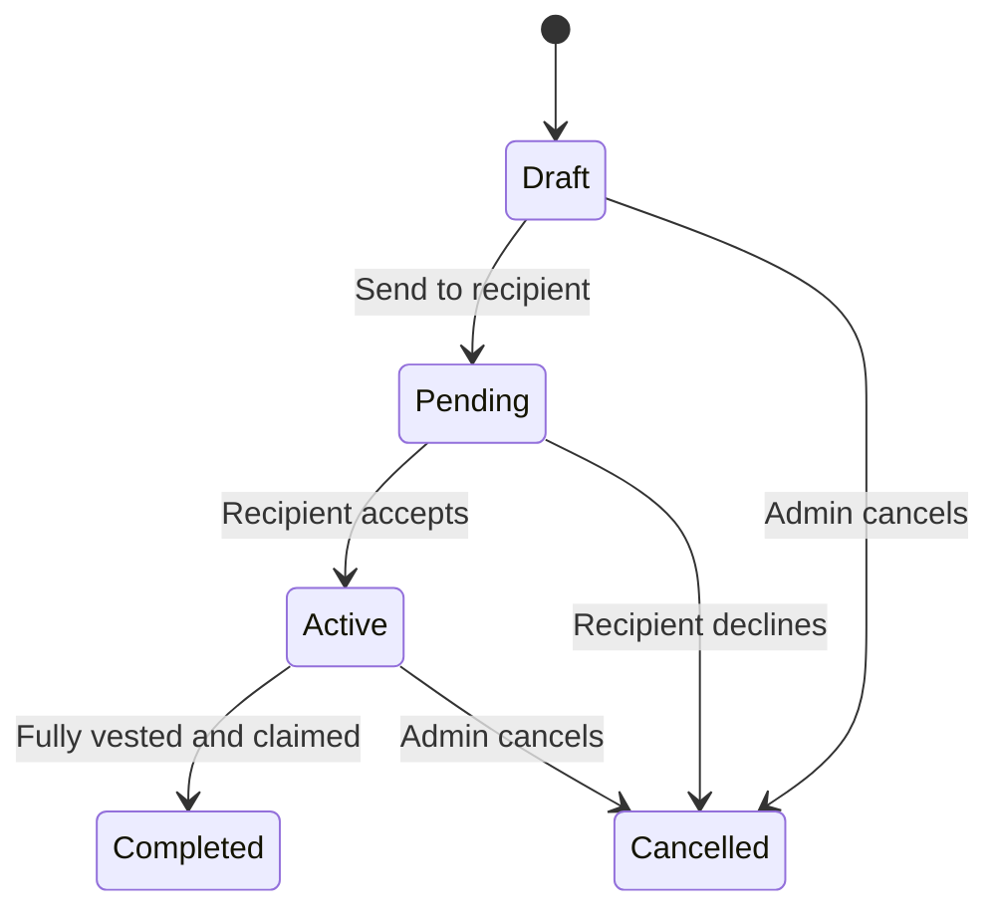

## Overview

Create token grants to award equity to your team members and investors. Each grant specifies the recipient, token amount, and vesting schedule.

---

## Creating a New Grant

<Tabs>
  <Tab title="Dashboard">
    <Steps>
      <Step title="Navigate to Grants">
        From the dashboard, click **Grants** in the sidebar.
      </Step>
      <Step title="Click New Grant">
        Select **New Grant** to open the grant creation form.
      </Step>
      <Step title="Select grant type">
        Choose the type of grant:
        - **RTU** — Restricted Token Units
        - **Options** — With strike price
        - **Warrants** — For investors
        - **Token Bonus** — One-time award
      </Step>
      <Step title="Enter recipient details">
        Add the recipient:
        - Email address
        - Full legal name
        - Country of residence
      </Step>
      <Step title="Configure grant terms">
        Specify the grant details:
        - Number of tokens
        - Grant date
        - Vesting schedule
        - Any conditions or notes
      </Step>
      <Step title="Review and create">
        Review the summary and click **Create Grant**.
      </Step>
    </Steps>
  </Tab>
  <Tab title="API">
    Use the [Add Single Grant](/api/grants/add-single-grant) endpoint:

    ```bash
    curl -X POST "https://api.toku.com/api/grants/addSingleGrant" \
      -H "Authorization: Bearer YOUR_API_KEY" \
      -H "Content-Type: application/json" \
      -d '{
        "configurationID": 1,
        "recipientEmail": "alex@example.com",
        "recipientName": "Alex Rivera",
        "tokenAmount": 50000,
        "grantDate": "2025-02-01",
        "vestingPeriodMonths": 48,
        "cliffMonths": 12,
        "vestingFrequency": "monthly"
      }'
    ```

    For new hires, use [Create Grant for New Hire](/api/grants/create-grant-for-new-hire) to create the grant and employee record in one call.
  </Tab>
</Tabs>

---

## Grant Types

### RTU (Restricted Token Units)
Tokens that vest over time with no purchase required. Once vested, the recipient can claim them.

### Options
The right to purchase tokens at a predetermined strike price. Recipients must exercise their options to receive tokens.

**Additional fields for Options:**
- Strike price per token
- Exercise window (when options can be exercised)
- Expiration date

### Warrants
Similar to options but typically issued to investors, advisors, or strategic partners.

### Token Bonus
One-time token awards that may vest immediately or on a specific date.

---

## Vesting Configuration

When creating a grant, select or configure a vesting schedule:

| Parameter | Description |
|-----------|-------------|
| **Vesting Period** | Total time over which tokens vest (e.g., 4 years) |
| **Cliff** | Initial period before any tokens vest (e.g., 1 year) |
| **Vesting Frequency** | How often tokens vest after the cliff (monthly, quarterly, yearly) |

**Example:** 4-year vesting with 1-year cliff
- Year 1: No tokens vest (cliff)
- After cliff: 25% vests immediately
- Years 2-4: Remaining 75% vests monthly

<Card title="Vesting Schedules" icon="calendar" href="/tga/client/managing-vesting-schedules">
  Learn more about vesting configurations
</Card>

---

## Recipient Notification

After creating a grant, the recipient receives an email with:
- Grant details and terms
- Link to view their grant in TGA
- Instructions for setting up their account

---

## Grant Status



| Status | Description |
|--------|-------------|
| **Draft** | Grant created but not sent to recipient |
| **Pending** | Sent to recipient, awaiting acceptance |
| **Active** | Accepted and actively vesting |
| **Completed** | Fully vested and claimed |
| **Cancelled** | Grant cancelled before completion |

---

## Bulk Grant Creation

For multiple grants, use the bulk import feature:

1. Navigate to **Grants** > **Import**
2. Download the CSV template
3. Fill in grant details for each recipient
4. Upload the completed CSV
5. Review and confirm all grants

---

<Tip>
**TGA Client Guide** — Step 2 of 6. [Previous: Setting Up Your Account](/tga/client/setting-up-your-account) | [Next: Managing Vesting Schedules](/tga/client/managing-vesting-schedules)
</Tip>

## Next Steps

<CardGroup cols={2}>
  <Card title="Manage Vesting" icon="calendar" href="/tga/client/managing-vesting-schedules">
    Configure vesting schedules
  </Card>
  <Card title="Distribute Tokens" icon="paper-plane" href="/tga/client/token-distributions">
    Process token distributions
  </Card>
</CardGroup>
