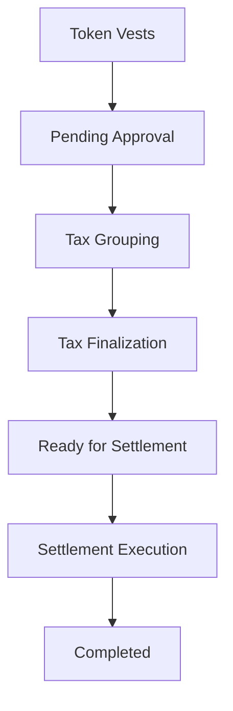

## Overview

When tokens vest, they need to be settled — meaning the actual tokens are transferred to the recipient's wallet. The settlement process involves tax calculation, approval, and execution through your custody provider.

<Frame caption="Settlement workflow">
  
</Frame>

---

## Settlement Workflow

---

## Step 1: Pending Approval

When vesting events occur, they appear in the **Pending Approval** tab of the Schedule Manager. An admin must approve each vesting before it can proceed.

---

## Step 2: Tax Grouping

After approval, vestings move to **Tax Grouping**. Here you assign tax details:

- **Manual tax**: Enter tax amounts directly
- **Payroll tax**: Use tax details from your payroll provider
- **No tax**: Mark as tax-exempt

---

## Step 3: Tax Finalization

Tax details are reviewed and finalized. Admin can approve or reject tax calculations. Rejected items return to the Tax Grouping stage.

---

## Step 4: Ready for Settlement

Vestings with finalized tax details are ready for settlement. You can:

- **Batch settlements** — Process multiple vestings together
- **Select custody provider** — Choose Fireblocks, Anchorage, or Safe
- **Generate settlement documents** — Create proof-of-payment records

---

## Step 5: Execution

The settlement is executed through your connected custody provider:

- **Fireblocks**: Transaction submitted to Fireblocks vault
- **Anchorage**: Transaction submitted to Anchorage
- **Safe**: Multisig transaction created, requiring signer approvals

---

## Unified Schedule Manager

The Schedule Manager provides a single interface for the entire settlement flow with 6 tabs:

| Tab | Purpose |
|-----|---------|
| Distribution Config | Set FMV mode and variance thresholds |
| Pending Approval | Approve vesting events |
| Tax Grouping | Assign tax details |
| Tax Finalization | Review and finalize tax |
| Ready for Settlement | Eligible for distribution |
| Settlements | Pending and completed settlements |

---

## Related

<CardGroup cols={2}>
  <Card title="Token Distributions" icon="share-nodes" href="/tga/client/token-distributions">
    Distribution overview and configuration
  </Card>
  <Card title="Custody Integrations" icon="vault" href="/tga/client/custody-overview">
    Set up custody providers for settlement execution
  </Card>
</CardGroup>
