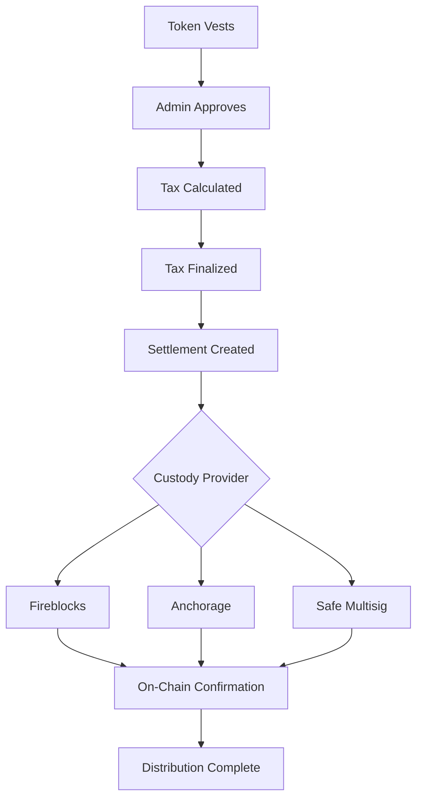

## Overview

Token distributions send vested tokens from your organization to recipients' wallets through your connected custody provider. TGA handles the full flow from vesting through tax calculation to on-chain settlement.

---

## Distribution Views

### Upcoming Distributions

Shows vestings that are coming due. Monitor what's approaching and prepare for settlement.

### Historical Distributions

View completed distributions with transaction details, amounts, and on-chain confirmations.

---

## Distribution Workflow

<Steps>
  <Step title="Vesting occurs">
    Tokens vest according to the grant's schedule. Vested amounts appear in the **Pending Approval** queue.
  </Step>
  <Step title="Admin approves">
    Review and approve vesting events. Batch approve multiple vestings at once.
  </Step>
  <Step title="Tax calculation">
    Assign tax details — manual, from payroll, or mark as tax-exempt. Tax amounts are calculated based on FMV and jurisdiction rules.
  </Step>
  <Step title="Tax finalization">
    Review tax calculations and finalize. Rejected items return to tax grouping.
  </Step>
  <Step title="Settlement execution">
    Create settlement batches and route through your custody provider:
    - **Fireblocks** — Direct vault transaction
    - **Anchorage** — Institutional settlement
    - **Safe** — Multisig approval required
  </Step>
  <Step title="Confirmation">
    Track on-chain transaction status. Once confirmed, the distribution is complete.
  </Step>
</Steps>

---

## Batch Transactions

Process multiple settlements together for efficiency:

1. Navigate to **Batch Transactions**
2. Select vestings ready for settlement
3. Choose your custody provider
4. Submit the batch
5. Track status: Pending Allocation → Pending Execution → Executed

---

## Tax Withholding

TGA supports tax withholding during settlement:

| Detail | Description |
|--------|-------------|
| **Gross tokens** | Total vested amount |
| **Withholding** | Tokens held for tax obligations |
| **Net tokens** | Amount sent to recipient wallet |
| **FMV** | Fair market value at time of vesting |

---

## Settlement Documents

Generate proof-of-payment and tax documents:
- Settlement summaries per recipient
- Tax reference documents
- Distribution confirmation records

---

## Next Steps

<CardGroup cols={2}>
  <Card title="Settlements" icon="file-invoice-dollar" href="/tga/client/settlements">
    Detailed settlement workflow
  </Card>
  <Card title="Custody Integrations" icon="vault" href="/tga/client/custody-overview">
    Connect custody providers
  </Card>
  <Card title="Reporting" icon="chart-line" href="/tga/client/reporting-and-compliance">
    Distribution reports
  </Card>
</CardGroup>
