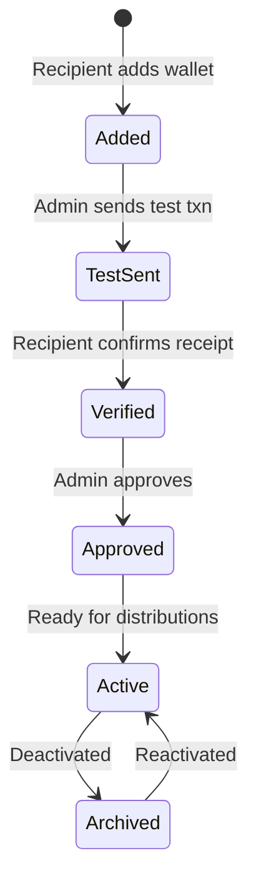

## Overview

Before tokens can be distributed, recipients need to add their blockchain wallets. Wallets go through a verification process to ensure they are valid and owned by the recipient.

---

## Wallet Lifecycle

---

## Adding Wallets

Recipients can add wallets through the employee portal, or admins can add them on behalf of recipients.

**Required information:**
- **Wallet address** — The blockchain address
- **Network** — Which blockchain (Ethereum, Solana, etc.)
- **Wallet type** — Configured by the admin (e.g., "Hot Wallet", "Custody")

<Tip>
**API:** Use [Add Wallet](/api/wallets/add-wallet) to add wallets programmatically, or [Bulk Upload Wallets](/api/wallets/bulk-upload-wallets) for multiple wallets.
</Tip>

---

## Wallet Verification

Wallet verification uses test transactions to confirm the recipient controls the address.

<Steps>
  <Step title="Admin initiates test transaction">
    Go to the wallet management page and click **Send Test Transaction** for the wallet.
  </Step>
  <Step title="System sends a small amount">
    A configurable amount of tokens is sent to the wallet address. The recipient receives an email notification.
  </Step>
  <Step title="Recipient confirms receipt">
    The recipient logs in and confirms they received the test transaction.
  </Step>
  <Step title="Admin approves">
    The admin reviews and approves the verified wallet.
  </Step>
</Steps>

<Tip>
**API:** Use [Send Test Transaction](/api/wallets/send-test-transaction) to initiate verification, then [Approve Wallet Request](/api/wallets/approve-wallet-request) to approve.
</Tip>

---

## Managing Wallets

| Action | Description | API |
|--------|-------------|-----|
| **Deactivate** | Move a wallet to historical | [Deactivate Wallet](/api/wallets/deactivate-wallet) |
| **Reactivate** | Restore a deactivated wallet | [Reactivate Wallet](/api/wallets/reactivate-wallet) |
| **Reject** | Reject a wallet submission | [Reject Wallet](/api/wallets/reject-wallet) |
| **Cancel** | Cancel a pending request | [Cancel Wallet Request](/api/wallets/cancel-wallet-request) |

---

## Wallet Distribution

Once wallets are verified and approved, configure how tokens are distributed across a recipient's wallets.

<Steps>
  <Step title="Navigate to wallet distribution settings">
    Go to the recipient's wallet configuration.
  </Step>
  <Step title="Set distribution ratios">
    Assign a percentage or fixed amount to each wallet. Ratios must total 100%.
  </Step>
  <Step title="Save">
    The distribution configuration applies to all future vestings for that recipient.
  </Step>
</Steps>

<Tip>
**API:** Use [Configure Wallet Distribution for Grant](/api/wallets/configure-wallet-distribution-for-grant) or [Set Token Wallet Distribution](/api/wallets/set-token-wallet-distribution) for programmatic configuration.
</Tip>

---

## Related

<CardGroup cols={2}>
  <Card title="Wallet Verification API" icon="shield-check" href="/api/wallets/send-test-transaction">
    Automate wallet verification via API
  </Card>
  <Card title="Token Distributions" icon="share-nodes" href="/tga/client/token-distributions">
    Learn how distributions work after wallets are set up
  </Card>
</CardGroup>
