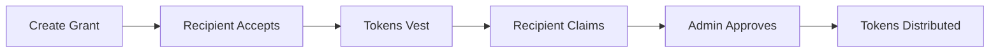

## What is TGA?

Token Grant Administration (TGA) is Toku's platform for managing token-based equity compensation. It helps organizations:

- Create and issue token grants to employees, contractors, and investors
- Configure flexible vesting schedules
- Track cap table and ownership
- Process token distributions with institutional custody
- Maintain compliance with tax and reporting requirements

---

## Who Uses TGA?

### Clients (Administrators)
Organization admins use TGA to set up grant programs, create individual grants, and process distributions.

<Card title="Client Guides" icon="user-gear" href="/tga/client/setting-up-your-account">
  Learn how to manage token grants
</Card>

### Recipients (Employees, Investors)
Grant recipients use TGA to view their grants, track vesting progress, and claim tokens.

<Card title="User Guides" icon="user" href="/tga/user/employee-portal">
  Learn how to view and claim grants
</Card>

---

## How It Works



---

## Key Features

<CardGroup cols={2}>
  <Card title="Grant Management" icon="gift">
    Create grants with customizable terms, vesting schedules, and conditions.
  </Card>
  <Card title="Vesting Schedules" icon="calendar">
    Configure cliff, linear, milestone, or custom vesting.
  </Card>
  <Card title="Token Distributions" icon="paper-plane">
    Process distributions through institutional custody providers.
  </Card>
  <Card title="Cap Table" icon="chart-pie">
    Track ownership and grants across your organization.
  </Card>
  <Card title="Compliance" icon="shield-check">
    Built-in KYC verification and tax withholding.
  </Card>
  <Card title="Reporting" icon="chart-bar">
    Generate reports for accounting and compliance.
  </Card>
</CardGroup>

---

## Example: Issuing an RTU Grant to Alex

Alex joins Acme Labs as a founding engineer. The company awards him 50,000 RTUs with a standard 4-year vesting schedule and 1-year cliff.

**1. Admin creates the grant.** In TGA, the admin selects RTU, enters Alex's details, and configures 4-year vesting with a 1-year cliff and monthly vesting thereafter.

**2. Alex receives a notification** and logs into TGA to review the grant terms. He accepts the grant and sets up his wallet address.

**3. After the 1-year cliff,** 12,500 tokens (25%) vest immediately. Alex navigates to his grants page and clicks "Claim" to request distribution.

```json
{
  "grantID": "grant_8Kx2mP",
  "recipient": "Alex Rivera",
  "type": "RTU",
  "totalTokens": 50000,
  "vestedTokens": 12500,
  "claimedTokens": 12500,
  "vestingSchedule": {
    "totalPeriod": "4 years",
    "cliff": "1 year",
    "frequency": "Monthly"
  },
  "status": "Active"
}
```

**4. Admin approves the claim.** TGA sends the distribution request to the custody provider, withholds tokens for tax obligations, and transfers the net tokens to Alex's wallet. Alex can track the on-chain transaction in real time.

---

## Supported Grant Types

| Type | Description |
|------|-------------|
| **RTU** | Restricted Token Units — tokens that vest over time |
| **Options** | Right to purchase tokens at a set strike price |
| **Warrants** | Similar to options, typically for investors |
| **Token Bonus** | One-time token awards |

---

## Getting Started

<CardGroup cols={2}>
  <Card title="Set Up Your Account" icon="gear" href="/tga/client/setting-up-your-account">
    Configure TGA for your organization
  </Card>
  <Card title="Create Your First Grant" icon="plus" href="/tga/client/creating-grants">
    Issue a token grant to a recipient
  </Card>
</CardGroup>
