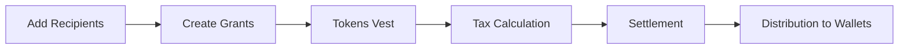

## What is TGA?

Token Grant Administration (TGA) is Toku's platform for managing token-based equity compensation. It covers the full lifecycle from grant creation through vesting to settlement.

<Frame caption="TGA Dashboard">
  
</Frame>

---

## Core Capabilities

<CardGroup cols={3}>
  <Card title="Grants" icon="award">
    Create and manage token grants with configurable vesting schedules
  </Card>
  <Card title="Distributions" icon="share-nodes">
    Process settlements through institutional custody providers
  </Card>
  <Card title="Wallets" icon="wallet">
    Manage recipient wallets with automated verification
  </Card>
  <Card title="Cap Table" icon="chart-pie">
    Track token ownership across your organization
  </Card>
  <Card title="Tax & Compliance" icon="shield-check">
    Tax calculation, withholding, and settlement documents
  </Card>
  <Card title="API" icon="code">
    Full REST API for programmatic integration
  </Card>
</CardGroup>

---

## Grant Types

| Type | Description |
|------|-------------|
| **RTU** (Restricted Token Units) | Tokens that vest over time with no purchase required |
| **RTA** (Restricted Token Awards) | Token awards with performance or other restrictions |
| **TPA** (Token Purchase Agreements) | Right to purchase tokens at a set price |
| **TOKEN_BONUS** | One-time token awards |

---

## How It Works

1. **Add recipients** — Onboard employees and assign roles
2. **Create grants** — Issue grants with vesting schedules
3. **Tokens vest** — Automatic vesting based on schedule
4. **Tax calculation** — Calculate and finalize tax obligations
5. **Settlement** — Execute distributions through custody providers
6. **Distribution** — Tokens delivered to recipient wallets

---

## For Administrators

<CardGroup cols={2}>
  <Card title="Onboarding Checklist" icon="list-check" href="/tga/client/onboarding-checklist">
    Complete your 6-step account setup
  </Card>
  <Card title="Creating Grants" icon="plus" href="/tga/client/creating-grants">
    Issue token grants to recipients
  </Card>
  <Card title="Wallet Setup" icon="wallet" href="/tga/client/wallet-setup">
    Configure wallets and verification
  </Card>
  <Card title="Settlements" icon="file-invoice-dollar" href="/tga/client/settlements">
    Process token distributions
  </Card>
</CardGroup>

## For Recipients

<CardGroup cols={2}>
  <Card title="Employee Portal" icon="user" href="/tga/user/employee-portal">
    Navigate the TGA portal
  </Card>
  <Card title="Understanding Vesting" icon="calendar" href="/tga/user/understanding-vesting">
    Learn how your tokens vest
  </Card>
</CardGroup>

## For Developers

<CardGroup cols={2}>
  <Card title="API Reference" icon="code" href="/api/overview">
    65+ REST API endpoints with interactive playground
  </Card>
  <Card title="Quick Start" icon="rocket" href="/api/quickstart">
    Make your first API call in 5 minutes
  </Card>
</CardGroup>
