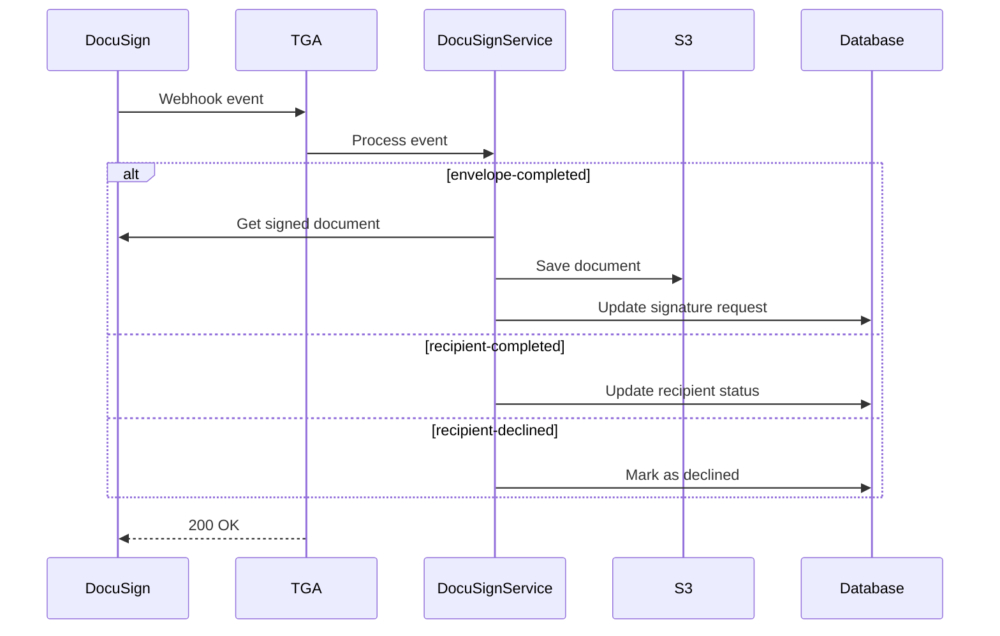

## Overview

TGA receives webhooks from DocuSign Connect to track document signing progress. This enables automatic grant acceptance, exercise processing, and document storage when recipients sign agreements.

## Webhook Endpoint

```
POST /api/webhooks/docusign
```

## Supported Events

| Event | Description | Action |
|-------|-------------|--------|
| `envelope-completed` | All recipients signed | Save document, update status |
| `recipient-completed` | One recipient signed | Update signature timestamp |
| `recipient-declined` | Recipient declined | Mark as declined |

## Event Payloads

### envelope-completed

```typescript
interface EnvelopeCompletedEvent {
    event: 'envelope-completed';
    data: {
        envelopeId: string;
        status: 'completed';
        completedDateTime: string;
    };
}
```

### recipient-completed

```typescript
interface RecipientCompletedEvent {
    event: 'recipient-completed';
    data: {
        envelopeId: string;
        recipientId: string;
        status: 'completed';
        signedDateTime: string;
    };
}
```

### recipient-declined

```typescript
interface RecipientDeclinedEvent {
    event: 'recipient-declined';
    data: {
        envelopeId: string;
        recipientId: string;
        declinedDateTime: string;
        declinedReason?: string;
    };
}
```

## Processing Flow



## Handler Implementation

### Event Routing

```typescript
export default async function handler(req, res) {
    const { event } = req.body;

    const docusignService = new DocusignService(creds, prisma);

    switch (event) {
        case 'envelope-completed':
            await docusignService.getSignedEnvelopeFromDocumentAndSave(
                req.body.data.envelopeId
            );
            break;

        case 'recipient-completed':
            await docusignService.updateEnvelopeRecipientStatus(
                req.body.data.envelopeId,
                req.body.data.recipientId,
                new Date(),  // signedAt
                undefined    // declinedAt
            );
            break;

        case 'recipient-declined':
            await docusignService.updateEnvelopeRecipientStatus(
                req.body.data.envelopeId,
                req.body.data.recipientId,
                undefined,   // signedAt
                new Date()   // declinedAt
            );
            break;

        default:
            // Ignore unknown events
            break;
    }

    return res.status(200).json({ success: true });
}
```

## Document Use Cases

### Grant Acceptance

When a grant recipient signs their grant agreement:

1. Webhook received: `envelope-completed`
2. Signed document saved to S3
3. Grant status updated to `ACCEPTED`
4. Vesting schedule begins

### Option Exercise

When a recipient signs an exercise notice:

1. Webhook received: `envelope-completed`
2. Exercise notice saved to S3
3. Exercise request status updated to `PENDING_TOKU_ACCEPTANCE`
4. Admin notified for approval

## Document Storage

### Save to S3

```typescript
async getSignedEnvelopeFromDocumentAndSave(envelopeId: string) {
    // Get signed document from DocuSign
    const documentBuffer = await this.getEnvelopeDocument(envelopeId);

    // Save to S3
    const key = `documents/signed/${envelopeId}.pdf`;
    await s3.putObject({
        Bucket: process.env.DOCUMENTS_BUCKET,
        Key: key,
        Body: documentBuffer,
        ContentType: 'application/pdf'
    });

    // Update signature request with document location
    await this.prisma.signatureRequest.update({
        where: { envelopeId },
        data: {
            signedDocumentKey: key,
            completedAt: new Date()
        }
    });
}
```

## Recipient Status Tracking

### Update Recipient

```typescript
async updateEnvelopeRecipientStatus(
    envelopeId: string,
    recipientId: string,
    signedAt?: Date,
    declinedAt?: Date
) {
    await this.prisma.signatureRecipient.update({
        where: {
            envelopeId_recipientId: { envelopeId, recipientId }
        },
        data: {
            signedAt,
            declinedAt,
            status: declinedAt ? 'DECLINED' : 'SIGNED'
        }
    });
}
```

## Configuration

### Environment Variables

```bash
# DocuSign API credentials
DOCUSIGN_INTEGRATION_KEY=your-integration-key
DOCUSIGN_SECRET_KEY=your-secret-key
DOCUSIGN_ACCOUNT_ID=your-account-id
DOCUSIGN_BASE_URL=https://demo.docusign.net/restapi

# Optional: Webhook authentication key
DOCUSIGN_CONNECT_KEY=your-connect-key
```

### DocuSign Connect Setup

1. Navigate to **Settings** > **Connect**
2. Create new configuration
3. Set webhook URL: `https://your-domain.com/api/webhooks/docusign`
4. Select events:
   - Envelope Completed
   - Recipient Completed
   - Recipient Declined
5. Enable configuration

## Debugging

### Local Development

Webhook payloads are saved to S3 in development:

```typescript
if (isLocal()) {
    await s3.putObject({
        Bucket: process.env.SPACE_NAME,
        Key: `docusign-webhook/${new Date().toISOString()}.json`,
        Body: JSON.stringify(req.body)
    });
}
```

### Testing Webhooks

Use DocuSign's Connect logs to:
- View sent webhooks
- Resend failed webhooks
- Check delivery status

## Troubleshooting

<AccordionGroup>
<Accordion title="Webhook not received">
**Cause:** Connect configuration issue.

**Solutions:**
1. Verify webhook URL is accessible
2. Check Connect is enabled
3. Review Connect failure logs in DocuSign
</Accordion>

<Accordion title="Document not saved">
**Cause:** S3 or API error.

**Solutions:**
1. Check S3 bucket permissions
2. Verify DocuSign API credentials
3. Review error logs
</Accordion>

<Accordion title="Grant status not updating">
**Cause:** Missing envelope-signature request mapping.

**Solutions:**
1. Verify signature request was created
2. Check envelope ID matches
3. Review database records
</Accordion>
</AccordionGroup>
