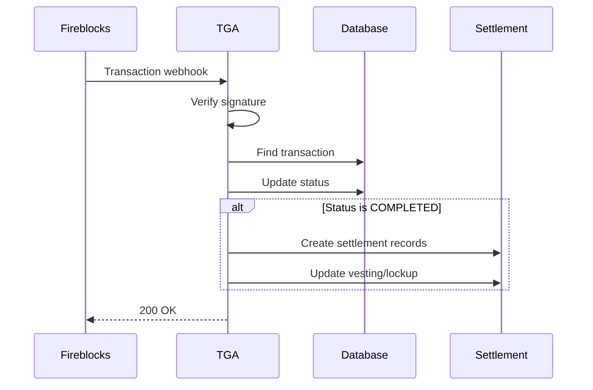

## Overview

TGA receives webhooks from Fireblocks to track transaction status changes. This enables automatic settlement completion when custody transactions are confirmed on-chain.

## Webhook Endpoints

| Endpoint | Purpose |
|----------|---------|
| `/api/webhooks/fireblocks/transactions` | Main transaction updates |
| `/api/webhooks/fireblocks/test-transactions` | Wallet verification transactions |

## Transaction Webhook

### Event Payload

```typescript
interface FireblocksTransactionWebhook {
    type: 'TRANSACTION_STATUS_UPDATED';
    data: {
        id: string;           // Fireblocks transaction ID
        status: TransactionStateEnum;
        txHash: string;       // Blockchain transaction hash
    };
}
```

### Transaction Statuses

| Status | Description | Action |
|--------|-------------|--------|
| `SUBMITTED` | Transaction submitted | Update status |
| `PENDING_SIGNATURE` | Awaiting signatures | Update status |
| `BROADCASTING` | Broadcasting to network | Update status |
| `CONFIRMING` | Awaiting confirmations | Update status |
| `COMPLETED` | Transaction confirmed | Complete settlement |
| `FAILED` | Transaction failed | Mark as failed |
| `CANCELLED` | Transaction cancelled | Mark as cancelled |

## Processing Flow



## Handler Implementation

### Signature Verification

```typescript
const signature = req.headers['fireblocks-signature'] as string;
const publicKey = process.env.FIREBLOCKS_WEBHOOK_PUBLIC_KEY;

const verificationResult = verifyWebhookSignature(
    JSON.stringify(req.body),
    signature,
    publicKey
);

if (!verificationResult.valid) {
    return res.status(401).json({ error: verificationResult.error });
}
```

### Transaction Lookup

```typescript
const fireblocksTransaction = await prisma.fireblocksTransaction.findFirst({
    where: {
        externalTransactionID: webhookData.id
    },
    include: {
        roleInOrg: true,
        taxReference: {
            include: {
                lockups: true,
                vestings: true,
                warrantLockups: true
            }
        }
    }
});
```

### Status Update

```typescript
await prisma.fireblocksTransaction.update({
    where: {
        fireblocksTransactionID: transaction.fireblocksTransactionID
    },
    data: {
        status: webhookData.status,
        lastStatusChangeAt: new Date()
    }
});
```

## Settlement Completion

When a transaction is `COMPLETED`:

### 1. Create Settlement Records

For each lockup in the transaction:

```typescript
await prisma.settlementRecord.create({
    data: {
        roleInOrgID: transaction.roleInOrgID,
        settledUnits: settledUnitsFromThisLockup,
        withheldUnits: withheldUnitsFromThisLockup,
        lockupID: lockup.lockupID,
        settlementMethod: SettlementMethod.FIREBLOCKS,
        transactionHash: webhookData.txHash,
        settledAt: new Date()
    }
});
```

### 2. Update Lockup Status

```typescript
await prisma.lockup.update({
    where: { lockupID },
    data: {
        status: 'SETTLED',
        settledAt: new Date()
    }
});
```

### 3. Update Tax Reference

```typescript
await prisma.taxReference.update({
    where: { taxReferenceID },
    data: {
        status: 'COMPLETED',
        completedAt: new Date()
    }
});
```

## Test Transaction Webhook

Used for wallet verification test transactions:

### Purpose

- Verify employee wallets can receive tokens
- Small amount transaction to confirm address ownership

### Processing

```typescript
// Find pending wallet verification
const wallet = await prisma.wallet.findFirst({
    where: {
        testTransactionID: webhookData.id,
        status: WalletStatus.PENDING_TXN_APPROVAL
    }
});

// Update wallet status
if (webhookData.status === 'COMPLETED') {
    await prisma.wallet.update({
        where: { walletID: wallet.walletID },
        data: {
            status: WalletStatus.VERIFIED,
            verifiedAt: new Date()
        }
    });
}
```

## Configuration

### Environment Variables

```bash
# Fireblocks webhook public key for signature verification
FIREBLOCKS_WEBHOOK_PUBLIC_KEY=your-public-key-here
```

### Fireblocks Dashboard Setup

1. Navigate to **Settings** > **Webhooks**
2. Add webhook URL: `https://your-domain.com/api/webhooks/fireblocks/transactions`
3. Select events: `TRANSACTION_STATUS_UPDATED`
4. Copy the public key to environment variables

## Error Handling

### Missing Transaction

```typescript
if (!fireblocksTransaction) {
    return res.status(404).json({ error: 'Transaction not found' });
}
```

### Invalid Status

```typescript
if (!isValidStatus(webhookData.status)) {
    console.log('Unsupported status:', webhookData.status);
    return res.status(200).json({ message: 'Status not processed' });
}
```

## Troubleshooting

<AccordionGroup>
<Accordion title="Webhook signature verification fails">
**Cause:** Incorrect public key or payload modification.

**Solutions:**
1. Verify `FIREBLOCKS_WEBHOOK_PUBLIC_KEY` is correct
2. Ensure raw body is used for verification
3. Check no middleware modifies the body
</Accordion>

<Accordion title="Transaction not found">
**Cause:** Transaction created in Fireblocks but not in TGA.

**Solutions:**
1. Check transaction creation flow
2. Verify external transaction ID mapping
3. Review TGA transaction logs
</Accordion>

<Accordion title="Settlement not completing">
**Cause:** Missing related records or validation failure.

**Solutions:**
1. Check tax reference exists
2. Verify lockup records are present
3. Review settlement creation logs
</Accordion>
</AccordionGroup>
