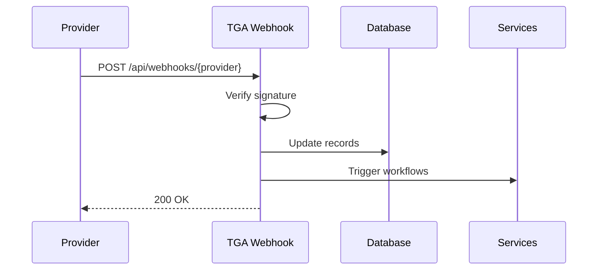

## Overview

TGA receives webhooks from external services to handle real-time events like transaction confirmations, document signatures, and identity verifications. This guide covers webhook setup and event handling.

## Supported Webhooks

| Provider | Events | Purpose |
|----------|--------|---------|
| **Fireblocks** | Transaction status | Custody settlements |
| **DocuSign** | Document signing | Grant acceptance, exercises |
| **Persona** | KYC verification | Identity verification |

## Webhook Architecture



## Webhook Endpoints

| Endpoint | Provider | Description |
|----------|----------|-------------|
| `/api/webhooks/fireblocks/transactions` | Fireblocks | Transaction updates |
| `/api/webhooks/fireblocks/test-transactions` | Fireblocks | Test transaction updates |
| `/api/webhooks/docusign` | DocuSign | Document events |
| `/api/webhooks/persona` | Persona | KYC events |

## Security

### Signature Verification

All webhooks verify request signatures:

```typescript
// Fireblocks signature verification
const verificationResult = verifyWebhookSignature(
    JSON.stringify(req.body),
    signature,
    publicKey
);

if (!verificationResult.valid) {
    return res.status(401).json({ error: verificationResult.error });
}
```

### Environment Variables

| Variable | Provider | Purpose |
|----------|----------|---------|
| `FIREBLOCKS_WEBHOOK_PUBLIC_KEY` | Fireblocks | Signature verification |
| `DOCUSIGN_CONNECT_KEY` | DocuSign | Webhook authentication |
| `PERSONA_WEBHOOK_SECRET` | Persona | Signature verification |

## Event Processing

### Best Practices

1. **Acknowledge quickly** - Return 200 OK before heavy processing
2. **Idempotency** - Handle duplicate events gracefully
3. **Error handling** - Log failures for debugging
4. **Retry logic** - Providers retry failed webhooks

### Processing Pattern

```typescript
const handler: NextApiHandler = async (req, res) => {
    // 1. Verify signature
    if (!verifySignature(req)) {
        return res.status(401).json({ error: 'Invalid signature' });
    }

    // 2. Parse event
    const event = parseEvent(req.body);

    // 3. Process event
    try {
        await processEvent(event);
    } catch (error) {
        console.error('Event processing failed:', error);
        // Still return 200 to prevent retries for permanent failures
    }

    // 4. Acknowledge
    return res.status(200).json({ success: true });
};
```

## Monitoring

### Logging

All webhook events are logged:

- Request headers
- Event type
- Processing result
- Error details (if any)

### Debugging

In development, webhook payloads can be saved to S3 for debugging:

```typescript
if (isLocal()) {
    await s3.putObject({
        Bucket: process.env.SPACE_NAME,
        Key: `webhooks/${provider}/${timestamp}.json`,
        Body: JSON.stringify(req.body)
    });
}
```

## Configuring Webhooks

### Provider Setup

Each provider requires webhook URL configuration:

<Steps>
<Step title="Get Webhook URL">
  Use your TGA domain: `https://your-tga-domain.com/api/webhooks/{provider}`
</Step>

<Step title="Configure in Provider">
  Add the webhook URL in the provider's dashboard.
</Step>

<Step title="Set Secret/Key">
  Add the verification key to TGA environment variables.
</Step>

<Step title="Test Webhook">
  Use provider's test feature to verify connectivity.
</Step>
</Steps>

## Related Guides

- **[Fireblocks Webhooks](/webhooks/fireblocks)** - Transaction event handling
- **[DocuSign Webhooks](/webhooks/docusign)** - Document signing events
- **[Persona Webhooks](/webhooks/persona)** - KYC verification events
