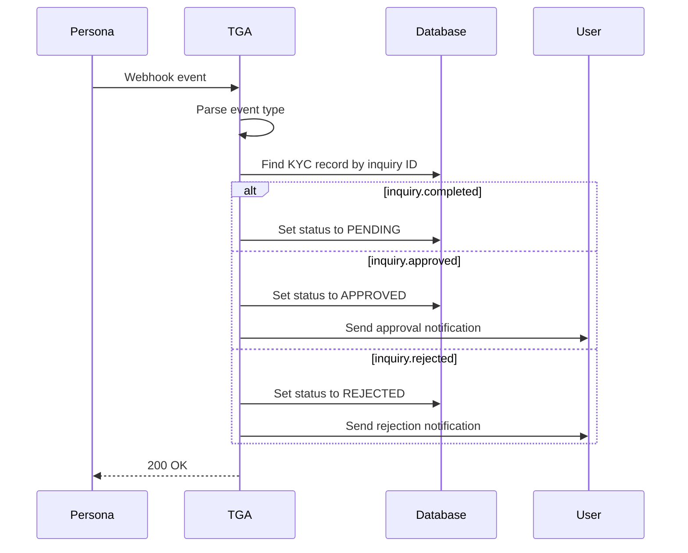
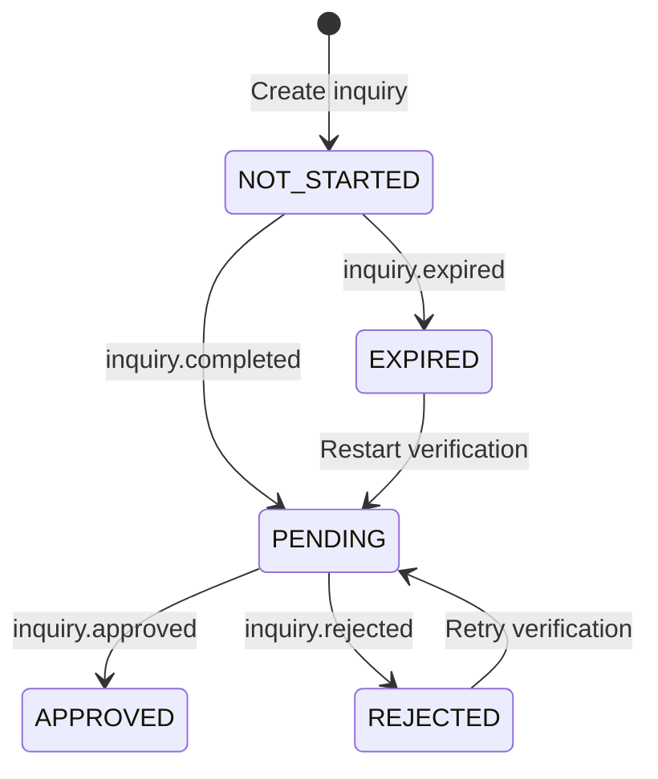

## Overview

TGA receives webhooks from Persona to track identity verification (KYC) status changes. This enables automatic status updates when users complete or fail identity verification.

## Webhook Endpoint

```
POST /api/webhooks/persona
```

## Supported Events

| Event | Description | Action |
|-------|-------------|--------|
| `inquiry.completed` | User submitted verification | Mark as pending review |
| `inquiry.approved` | Verification approved | Update KYC status to approved |
| `inquiry.rejected` | Verification rejected | Update KYC status to rejected |
| `inquiry.expired` | Verification expired | Mark for re-verification |

## Event Types

```typescript
enum PersonaEventType {
    INQUIRY_COMPLETED = 'inquiry.completed',
    INQUIRY_APPROVED = 'inquiry.approved',
    INQUIRY_REJECTED = 'inquiry.rejected',
    INQUIRY_EXPIRED = 'inquiry.expired'
}
```

## Event Payload

```typescript
interface PersonaEventPayload {
    id: string;  // Event ID
    attributes: {
        name: PersonaEventType;
        payload: {
            data: {
                id: string;  // Inquiry ID
                attributes: {
                    'reference-id': string;  // roleInOrgID
                    'name-first': string;
                    'name-last': string;
                    status: string;
                };
            };
        };
    };
}
```

## Processing Flow



## Handler Implementation

### Event Processing

```typescript
export default async function handler(req, res) {
    const eventPayload = req.body.data as PersonaEventPayload;

    const event_type = eventPayload.attributes?.name;
    const inquiry_id = eventPayload.attributes?.payload?.data?.id;
    const reference_id = eventPayload.attributes?.payload?.data?.attributes?.['reference-id'];

    console.log(`Processing Persona Event: ${event_type}, Inquiry ID: ${inquiry_id}`);

    if (!event_type || !inquiry_id) {
        return res.status(400).json({
            message: 'Missing required event data'
        });
    }

    switch (event_type) {
        case PersonaEventType.INQUIRY_COMPLETED:
            await handleInquiryCompleted(inquiry_id, reference_id);
            break;
        case PersonaEventType.INQUIRY_APPROVED:
            await handleInquiryApproved(inquiry_id);
            break;
        case PersonaEventType.INQUIRY_REJECTED:
            await handleInquiryRejected(inquiry_id);
            break;
        case PersonaEventType.INQUIRY_EXPIRED:
            await handleInquiryExpired(inquiry_id);
            break;
    }

    return res.status(200).json({ success: true });
}
```

### inquiry.completed

User submitted all verification documents:

```typescript
async function handleInquiryCompleted(inquiry_id: string, reference_id: string) {
    const kycRecord = await prisma.kycDetails.findFirst({
        where: { kycID: inquiry_id }
    });

    if (!kycRecord) {
        console.error('KYC Details not found for inquiryID:', inquiry_id);
        return;
    }

    await prisma.kycDetails.update({
        where: { kycDetailsID: kycRecord.kycDetailsID },
        data: {
            status: KycStatus.PENDING,
            submittedAt: new Date()
        }
    });

    // Optionally notify admin for manual review
}
```

### inquiry.approved

Verification passed all checks:

```typescript
async function handleInquiryApproved(inquiry_id: string) {
    const kycRecord = await prisma.kycDetails.findFirst({
        where: { kycID: inquiry_id }
    });

    await prisma.kycDetails.update({
        where: { kycDetailsID: kycRecord.kycDetailsID },
        data: {
            status: KycStatus.APPROVED,
            approvedAt: new Date()
        }
    });

    // Send approval notification to user
    await sendKycApprovalEmail(kycRecord.roleInOrgID);
}
```

### inquiry.rejected

Verification failed:

```typescript
async function handleInquiryRejected(inquiry_id: string) {
    const kycRecord = await prisma.kycDetails.findFirst({
        where: { kycID: inquiry_id }
    });

    await prisma.kycDetails.update({
        where: { kycDetailsID: kycRecord.kycDetailsID },
        data: {
            status: KycStatus.REJECTED,
            rejectedAt: new Date()
        }
    });

    // Send rejection notification with instructions
    await sendKycRejectionEmail(kycRecord.roleInOrgID);
}
```

### inquiry.expired

Verification window expired:

```typescript
async function handleInquiryExpired(inquiry_id: string) {
    const kycRecord = await prisma.kycDetails.findFirst({
        where: { kycID: inquiry_id }
    });

    await prisma.kycDetails.update({
        where: { kycDetailsID: kycRecord.kycDetailsID },
        data: {
            status: KycStatus.EXPIRED,
            expiredAt: new Date()
        }
    });

    // Prompt user to restart verification
    await sendKycExpiredEmail(kycRecord.roleInOrgID);
}
```

## KYC Status Flow



## Configuration

### Environment Variables

```bash
# Persona API configuration
PERSONA_API_KEY=your-api-key
PERSONA_TEMPLATE_ID=your-template-id

# Optional: Webhook secret for signature verification
PERSONA_WEBHOOK_SECRET=your-webhook-secret
```

### Persona Dashboard Setup

1. Navigate to **Webhooks** in Persona dashboard
2. Create new webhook endpoint
3. Set URL: `https://your-domain.com/api/webhooks/persona`
4. Select events:
   - `inquiry.completed`
   - `inquiry.approved`
   - `inquiry.rejected`
   - `inquiry.expired`
5. Save webhook secret to environment variables

## Reference ID Mapping

Persona uses `reference-id` to link inquiries to TGA users:

```typescript
// When creating inquiry
const inquiry = await personaClient.createInquiry({
    templateId: PERSONA_TEMPLATE_ID,
    referenceId: roleInOrgID  // Links back to TGA user
});

// In webhook, reference_id = roleInOrgID
```

## Troubleshooting

<AccordionGroup>
<Accordion title="KYC record not found">
**Cause:** Inquiry created but not tracked in TGA.

**Solutions:**
1. Verify inquiry creation saves to database
2. Check inquiry ID mapping
3. Review KYC initiation flow
</Accordion>

<Accordion title="Status not updating">
**Cause:** Event processing error.

**Solutions:**
1. Check webhook logs for errors
2. Verify event type handling
3. Review database update query
</Accordion>

<Accordion title="Duplicate events">
**Cause:** Persona retries or multiple triggers.

**Solutions:**
1. Implement idempotency check
2. Verify event hasn't already been processed
3. Use event ID for deduplication
</Accordion>

<Accordion title="Missing reference ID">
**Cause:** Inquiry created without reference ID.

**Solutions:**
1. Ensure referenceId is set when creating inquiry
2. Handle null reference_id gracefully
3. Log for manual review if missing
</Accordion>
</AccordionGroup>
